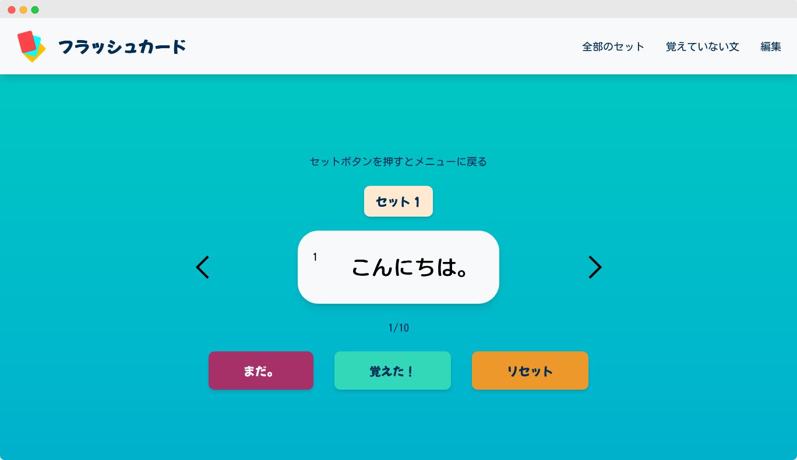

 

# English Flashcards App

## Table of contents

- [Overview](#overview)
  - [Main Function](#main-function)
  - [Links](#links)
- [My process](#my-process)
  - [Built with](#built-with)
  - [Continued development](#continued-development)

## Overview

### Main Function

Users should be able to:
- Access flashcard sets and start revising vocabulary that has been learnt in the past year. 
- Sort through the cards one by one and being able to see the the English and Japanese sides.
- Store cards needing to be learnt and revise them in a separate page.
- Remove cards that have been learnt from current deck.
- Being able to edit the master deck and editing the card contents (WIP)

### Links

- Solution URL: [Github Repo](https://github.com/kebin20/english-flashcards-app)
- Live Site URL: [English Flashcard App](https://english-flashcard.netlify.app/)

## My process

### Built with

- Semantic HTML5 markup
- CSS custom properties
- Flexbox
- CSS Grid
- CSS Modules
- [Firebase](https://firebase.google.com/) - Backend as a Service
- [TypeScript](https://www.typescriptlang.org/) - Strongly typed programming language on top of JS
- [React](https://reactjs.org/) - JS framework
- [React Router](https://reactrouter.com/en/main) - React routing library
- 

## What I learnt & Challenges I faced

- See my blog post on [DEV.to](https://dev.to/kebin20/my-learning-journey-through-my-english-flashcard-project-2odb)!

### Continued development & future implementations

- Enable users to edit the master deck and change the content of the flashcards first (WIP)
 - Afterwards, being able to delete the cards/sets and add new ones as the user wishes.
- Add a button to randomise the flashcards for extra variety.
- Add animation for the cards when they flip. 
