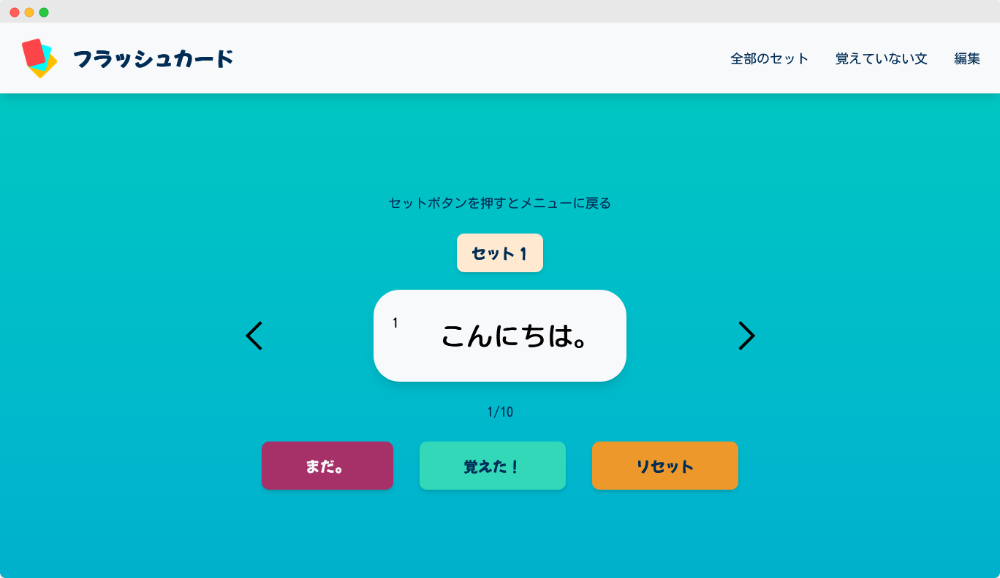

# English Flashcards App v2

A responsive English/Japanese flashcard app for practising sentences learned in Japanese elementary school.

- Live site: [english-flashcard.netlify.app](https://english-flashcard.netlify.app/)
- Repository: [github.com/kebin20/english-flashcards-app](https://github.com/kebin20/english-flashcards-app)

## V1 → V2 visual comparison

### V1 — original interface



### V2 — redesigned interface


The complete original V1 source remains available on the [`v1-legacy-backup`](https://github.com/kebin20/english-flashcards-app/tree/v1-legacy-backup) branch.

## What changed in v2

- Upgraded to React 19, React Router 7, Vite 8, TypeScript 6, and Node 24.
- Rebuilt the interface with a responsive, accessible visual system.
- Added animated card flipping, shuffling, progress feedback, keyboard controls, and a persisted review queue.
- Restored the missing card editor route and made edits persist safely in the current browser.
- Added runtime validation and an offline fallback for the remote flashcard data.
- Removed the accidental Firebase write on startup and all unused Redux, Chakra UI, Firebase SDK, styled-components, XLSX, and animation dependencies.
- Added strict linting, type-checking, regression tests, and an explicit Netlify deployment configuration.

## Local development

Requirements:

- Node.js 24 (the exact version is recorded in `.nvmrc`)
- Yarn 1.x

```bash
yarn install
yarn dev
```

Useful commands:

```bash
yarn lint
yarn typecheck
yarn test
yarn build
yarn verify
```

`yarn verify` runs the full quality gate: lint, type-check, tests, and production build.

## Data and privacy

The shared Firebase Realtime Database is read-only from the app. If it is unavailable, the bundled 98-card deck is used automatically.

Study progress, review cards, and card edits are stored in the browser's local storage. Editing a card never modifies the shared database or another learner's deck.

## Deployment

The repository includes `netlify.toml` and the existing SPA redirect. Netlify should build with Node 24, run `yarn build`, and publish `dist`. Keeping the current Netlify site connected to this repository preserves the existing public URL.
